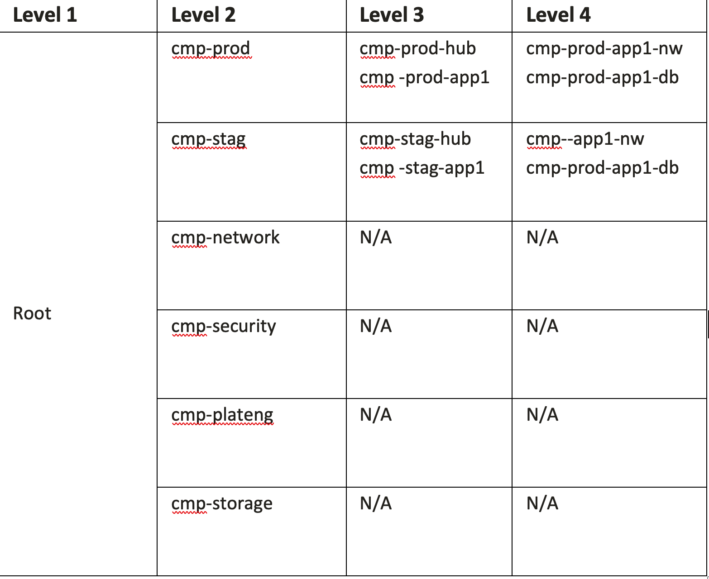

# Multitenant environment provisioning on Oracle Cloud Infrastructure (OCI)

This terraform module provides a terraform automation for provisioning a multitenant environment on Oracle Cloud Infrastructure.

It supports a highly configurable input set of parameters for provisioning the tenants topology for IAM Compartments, Networking and native Monitoring by leveraging OCI events. 

The input parameters, by using `*.auto.tfvars`, support almost any compartments and networking topology configuration without the need for the user to touch the `*.tf` files.

## Provisioned layers

### IAM Compartments

It supports the provisioning of any hierarchical structure of IAM Compartments. 

* Creating up to 6(OCI limit) hierarchical(one to another) compartments
  *  

***Example:***

Bellow you can see a 4 layers compartments structure out of which, as part of the app. provisioning, we'll provision 2nd half of layer 3 and layer 4.

 


To provision such a topology, the needed input in the ```iam.auto.tfvars``` is:

```
app_compartments_config = {
  default_compartment_id = "<parent_compartment_ocid>"
  default_defined_tags   = {}
  default_freeform_tags  = null
  compartments = {

    # Production Compartments
    cmp-prod-<application_acronym> = {
      description    = "Compartment holding production resources of <application_name> application"
      compartment_id = "<parent_compartment_ocid>"
      defined_tags   = null
      freeform_tags  = null
      enable_delete  = true
      sub_compartments = {
        cmp-prod-<application_acronym>-nw = {
          description   = "Compartment holding production network resources of <application_name> application"
          defined_tags  = null
          freeform_tags = null
          enable_delete = true
          sub_compartments = {}
        }
        cmp-prod-<application_acronym>-db = {
          description   = "Compartment holding production database resources of <application_name> application"
          defined_tags  = null
          freeform_tags = null
          enable_delete = true
          sub_compartments = {}
        }
      }
    }

    #Staging Compartments
    cmp-stag-<application_acronym> = {
      description    = "Compartment holding staging resources of <application_name> application"
      compartment_id = "<parent_compartment_ocid>"
      defined_tags   = null
      freeform_tags  = null
      enable_delete  = true
      sub_compartments = {
        cmp-stag-<application_acronym>-nw = {
          description   = "Compartment holding staging network resources of <application_name> application"
          defined_tags  = null
          freeform_tags = null
          enable_delete = true
          sub_compartments = {}
        }
        cmp-stag-<application_acronym>-db = {
          description   = "Compartment holding staging database resources of <application_name> application"
          defined_tags  = null
          freeform_tags = null
          enable_delete = true
          sub_compartments = {}
        }
      }
    }
  }
}
```

As one can notice the only file that needs to be editated in ```*.auto.tfvars``` and not a ```*.tf``` file.

Concerning the ```app_compartments_config``` variable definition, this is how it looks like:

```
variable "app_compartments_config" {
  type = object({
    default_compartment_id = string,
    default_defined_tags   = map(string),
    default_freeform_tags  = map(string),
    compartments = map(object({
      description    = string,
      compartment_id = string,
      defined_tags   = map(string),
      freeform_tags  = map(string),
      enable_delete  = bool,
      sub_compartments = map(object({
        description   = string,
        defined_tags  = map(string),
        freeform_tags = map(string),
        enable_delete = bool,
        sub_compartments = map(object({
          description   = string,
          defined_tags  = map(string),
          freeform_tags = map(string),
          enable_delete = bool,
          sub_compartments = map(object({
            description   = string,
            defined_tags  = map(string),
            freeform_tags = map(string),
            enable_delete = bool,
            sub_compartments = map(object({
              description   = string,
              defined_tags  = map(string),
              freeform_tags = map(string),
              enable_delete = bool,
              sub_compartments = map(object({
                description   = string,
                defined_tags  = map(string),
                freeform_tags = map(string),
                enable_delete = bool
              }))
            }))
          }))
        }))
      }))
    }))
  })
  description = "Parameters to provision zero, one or multiple compartments"
}
```

As you can see it supports a maximum of 6 layers of sub-compartments in any topology.


- First 3 atributes: 
   - ```default_compartment_id = string``` - if in the 1st layer of compartments defined in the hierarchy the ```compartment_id``` attribute is missing then ```default_compartment_id``` value will be used

   - ```default_defined_tags = map(string)```  - if any of the compartments in the hierarchy are missing the ```defined_tags``` attribute then the ```default_defined_tags``` value will be used.

   - ```default_freeform_tags = map(string)``` - if any of the compartments in the hierarchy are missing the ```freeform_tags``` attribute then the ```freeform_tags``` value will be used.

- Top hierarchy compartments definition: 

```
compartments = map(object({
      description    = string,
      compartment_id = string,
      defined_tags   = map(string),
      freeform_tags  = map(string),
      enable_delete  = bool,
      sub_compartments = ...
```

You can define here as many top layer compartments as you need having as many subcompartments as you want. The only limitation is that you can only have a max of 6 layers of hierarchical compartments.

The name of the compartment will be the key of the key/value pair entity you're defining.

```
    cmp-<app-name> = {
      description    = "Compartment holding resources of app"
      compartment_id = "ocid1.tenancy.oc1..aaa... "
      defined_tags   = null
      freeform_tags  = null
      enable_delete  = true
      sub_compartments = { ...
```

- Parent compartments:
    - The ```compartment_id``` needs to be provided for the top compartment of your hierarchy.
    - The parent compartment of the lower layers will be the one where you defined the curent compartment under:

```
 compartments = {
    cmp-<app-name> = {
      description    = "Compartment holding resources of app"
      compartment_id = "ocid1.tenancy.oc1..aaa ..."
      defined_tags   = null
      freeform_tags  = null
      enable_delete  = true
      sub_compartments = {
        cmp-vm-shared = {
          description   = "Shared Services for app [optional, can be used if not consumed from cmp-central]"
          defined_tags  = null
          freeform_tags = null
          enable_delete = true
          sub_compartments = {
```

Please note that the values keys are used as resources/object names in OCI.

### Networking

This automation provides the option to create 2 categories of network constructs under a tenant:
- **prod networking** - this is will be dedicated to production environments.
- **stag networking** - this will be dedicated to staging environments.

For each category you'll be able to define the follow:
 - any number of VCNs with the following configurations: 
    - compartment_name
    - cidr block
    - dns_label
    - IGW exposure
    - DRG attachment
    - NAT enablement
    - define tags
    - freeform tags
    - any number of subnets in the current VCN with the following configuration:
        - compartment_name
        - cidr
        - dns_label
        - private or public subnet
        - dhcp options
        - freeform tags
        - define tags
        - any number of security lists that will be asociated with this subnet
- All the VCNs defined in one of the 2 categories will also share the following attributes:
    - ```default_network_compartment_name``` - if inside the VCNs definition there is a component missing the compartment attribute then this value will be used.
    - ```service_label``` - this will be the service label used by all the VCNs in this category 
    - ```service_gateway_cidr``` - this will be the service gw cidr used by all the vcns in this category
    - ```drg_id``` - this will be the drg shared by all the vcns in this category.

Concerning the ```networking``` variable definition, this is how it looks like:

```
variable "networking" {
  description = "The VCNs."
  type = object({
    prod_networking = object({
      default_network_compartment_name = string,
      service_label                    = string,
      service_gateway_cidr             = string,
      drg_id                           = string,
      vcns = map(object({
        compartment_name  = string,
        cidr              = string,
        dns_label         = string,
        is_create_igw     = bool,
        is_attach_drg     = bool,
        block_nat_traffic = bool,
        defined_tags      = map(string),
        freeform_tags     = map(string),
        subnets = map(object({
          compartment_name = string,
          cidr             = string,
          dns_label        = string,
          private          = bool,
          dhcp_options_id  = string,
          defined_tags     = map(string),
          freeform_tags    = map(string),
          security_lists = map(object({
            is_create      = bool,
            compartment_id = string,
            defined_tags   = map(string),
            freeform_tags  = map(string),
            ingress_rules = list(object({
              is_create    = bool,
              stateless    = bool,
              protocol     = string,
              description  = string,
              src          = string,
              src_type     = string,
              src_port_min = number,
              src_port_max = number,
              dst_port_min = number,
              dst_port_max = number,
              icmp_type    = number,
              icmp_code    = number
            })),
            egress_rules = list(object({
              is_create    = bool,
              stateless    = bool,
              protocol     = string,
              description  = string,
              dst          = string,
              dst_type     = string,
              src_port_min = number,
              src_port_max = number,
              dst_port_min = number,
              dst_port_max = number,
              icmp_type    = number,
              icmp_code    = number
            }))
          }))
        }))
      }))
    })
    stag_networking = object({
      default_network_compartment_name = string,
      service_label                    = string,
      service_gateway_cidr             = string,
      drg_id                           = string,
      vcns = map(object({
        compartment_name  = string,
        cidr              = string,
        dns_label         = string,
        is_create_igw     = bool,
        is_attach_drg     = bool,
        block_nat_traffic = bool,
        defined_tags      = map(string),
        freeform_tags     = map(string),
        subnets = map(object({
          compartment_name = string,
          cidr             = string,
          dns_label        = string,
          private          = bool,
          dhcp_options_id  = string,
          defined_tags     = map(string),
          freeform_tags    = map(string),
          security_lists = map(object({
            is_create      = bool,
            compartment_id = string,
            defined_tags   = map(string),
            freeform_tags  = map(string),
            ingress_rules = list(object({
              is_create    = bool,
              stateless    = bool,
              protocol     = string,
              description  = string,
              src          = string,
              src_type     = string,
              src_port_min = number,
              src_port_max = number,
              dst_port_min = number,
              dst_port_max = number,
              icmp_type    = number,
              icmp_code    = number
            })),
            egress_rules = list(object({
              is_create    = bool,
              stateless    = bool,
              protocol     = string,
              description  = string,
              dst          = string,
              dst_type     = string,
              src_port_min = number,
              src_port_max = number,
              dst_port_min = number,
              dst_port_max = number,
              icmp_type    = number,
              icmp_code    = number
            }))
          }))
        }))
      }))
    })
  })
}
```

***Example***

I'll demonstrate how it can be defined in the ```networking.auto.tfvars``` a networking topology like the one presented in the diagram bellow.

 
 

One will just need to edit the ```networking.auto.tfvars``` and not a ```*.tf``` file and provide the following configuration in order to obtain the network topology from the above diagram:

```
networking = {

  # PROD VCNs
  prod_networking = {
    default_network_compartment_name = "cmp-prod-<application_acronym>-nw"
    service_label                    = "<application_name>"
    service_gateway_cidr             = "all-services-in-oracle-services-network"
    drg_id                           = null
    vcns = {
      # Production VCN
      <application_acronym>prod01-vcn = {
        compartment_name  = "cmp-prod-<application_acronym>-nw"
        cidr              = "10.0.0.0/22"
        dns_label         = "<application_acronym>prod01"
        is_create_igw     = false
        is_attach_drg     = false
        block_nat_traffic = false
        defined_tags      = null
        freeform_tags     = null
        subnets = {
          prod_private_infra = {
            compartment_name = "cmp-prod-<application_acronym>-nw"
            defined_tags     = null
            freeform_tags    = null
            cidr             = "10.0.0.0/24"
            dns_label        = "prdprvinfr"
            dhcp_options_id  = null
            security_lists   = {}
            private          = true
          }
          prod_private_app = {
            compartment_name = "cmp-prod-<application_acronym>-nw"
            defined_tags     = null
            freeform_tags    = null
            cidr             = "10.0.1.0/24"
            dns_label        = "prdprvapp"
            dhcp_options_id  = null
            security_lists   = {}
            private          = true
          }
          prod_private_db = {
            compartment_name = "cmp-prod-<application_acronym>-nw"
            defined_tags     = null
            freeform_tags    = null
            cidr             = "10.0.2.0/24"
            dns_label        = "prdprvdb"
            dhcp_options_id  = null
            security_lists   = {}
            private          = true
          }
        }
      }
    }
  }

    # STAG VCNs
  stag_networking = {
    default_network_compartment_name = "cmp-stag-<application_acronym>-nw"
    service_label                    = "<application_name>"
    service_gateway_cidr             = "all-services-in-oracle-services-network"
    drg_id                           = null
    vcns = {
      # STAG VCN
      <application_acronym>stag01-vcn = {
        compartment_name  = "cmp-stag-<application_acronym>-nw"
        cidr              = "192.168.0.0/17"
        dns_label         = "<application_acronym>stag01"
        is_create_igw     = false
        is_attach_drg     = false
        block_nat_traffic = false
        defined_tags      = null
        freeform_tags     = null
        subnets = {
          stag_private_infra = {
            compartment_name = "cmp-stag-<application_acronym>-nw"
            defined_tags     = null
            freeform_tags    = null
            cidr             = "192.168.0.0/24"
            dns_label        = "stagprvinfr"
            dhcp_options_id  = null
            security_lists   = {}
            private          = true
          }
          stag_private_app = {
            compartment_name = "cmp-stag-<application_acronym>-nw"
            defined_tags     = null
            freeform_tags    = null
            cidr             = "192.168.1.0/24"
            dns_label        = "stagprvapp"
            dhcp_options_id  = null
            security_lists   = {}
            private          = true
          }
          stag_private_db = {
            compartment_name = "cmp-stag-<application_acronym>-nw"
            defined_tags     = null
            freeform_tags    = null
            cidr             = "192.168.2.0/24"
            dns_label        = "stagprvdb"
            dhcp_options_id  = null
            security_lists   = {}
            private          = true
          }
        }
      }
    }
  }
}
```

Please note that the values keys are used as resources/object names in OCI specifically for VCNs, subnets and security lists.

### Networking Security

I want to emphasize that this is not limited to this specific structure. You can define your tenant template with any networking security topology.


- ```app_network_sec_config```:
     - Under the network security you can define multiple NSGs for one of the vcns provisioned during app provisioning
     - You can have multiple elements under the ```app_network_sec_config```

Concerning the ```app_network_sec_config``` variable definition, this is how it looks like:

```
variable "app_network_sec_config" {
  type = map(object({
    default_compartment_name = string,
    vcn_name                 = string,
    default_defined_tags     = map(string),
    default_freeform_tags    = map(string),
    security_lists = map(object({
      compartment_name = string,
      defined_tags     = map(string),
      freeform_tags    = map(string),
      ingress_rules = list(object({
        stateless = bool,
        protocol  = string,
        src       = string,
        src_type  = string,
        src_port = object({
          min = number,
          max = number
        }),
        dst_port = object({
          min = number,
          max = number
        }),
        icmp_type = number,
        icmp_code = number
      })),
      egress_rules = list(object({
        stateless = bool,
        protocol  = string,
        dst       = string,
        dst_type  = string,
        src_port = object({
          min = number,
          max = number
        }),
        dst_port = object({
          min = number,
          max = number
        }),
        icmp_type = number,
        icmp_code = number
      }))
    })),
    nsgs = map(object({
      compartment_name = string,
      defined_tags     = map(string),
      freeform_tags    = map(string),
      ingress_rules = list(object({
        description = string,
        stateless   = bool,
        protocol    = string,
        src         = string,
        # Allowed values: CIDR_BLOCK, SERVICE_CIDR_BLOCK, NETWORK_SECURITY_GROUP, NSG_NAME
        src_type = string,
        src_port = object({
          min = number,
          max = number
        }),
        dst_port = object({
          min = number,
          max = number
        }),
        icmp_type = number,
        icmp_code = number
      })),
      egress_rules = list(object({
        description = string,
        stateless   = bool,
        protocol    = string,
        dst         = string,
        # Allowed values: CIDR_BLOCK, SERVICE_CIDR_BLOCK, NETWORK_SECURITY_GROUP, NSG_NAME
        dst_type = string,
        src_port = object({
          min = number,
          max = number
        }),
        dst_port = object({
          min = number,
          max = number
        }),
        icmp_type = number,
        icmp_code = number
      }))
    }))
  }))
}
```

***Example***

I'll demonstrate how it can be defined in the ```networksecurity.auto.tfvars``` a network security topology.

One will just need to edit the ```networksecurity.auto.tfvars``` and not a ```*.tf``` file and provide the following configuration:

```
### app network security
app_network_sec_config = {
  # Prod Network Security
  <application_name>_netsec_<application_acronym>prod01-vcn = {
    default_compartment_name = "cmp-prod-<application_acronym>-nw",
    vcn_name                 = "<application_acronym>prod01-vcn",
    default_defined_tags     = null,
    default_freeform_tags    = null,
    security_lists           = {},
    nsgs = {
      nsg_db_<application_name>_netsec_<application_acronym>prod01-vcn = {
        compartment_name = "cmp-prod-<application_acronym>-nw"
        defined_tags     = null,
        freeform_tags    = null,
        ingress_rules = [
          {
            description = "APP NSGs"
            stateless   = false
            protocol    = "6"
            src         = "nsg_app_<application_name>_netsec_<application_acronym>prod01-vcn"
            src_type    = "NSG_NAME"
            src_port    = null
            dst_port = {
              min = "1521"
              max = "1521"
            }
            icmp_code = null
            icmp_type = null
          }
        ]
        egress_rules = [
          {
            description = "egress to anywhere"
            stateless   = false
            protocol    = "all"
            dst         = "0.0.0.0/0"
            dst_type    = "CIDR_BLOCK"
            src_port    = null
            dst_port    = null
            icmp_code   = null
            icmp_type   = null
          }
        ]
      },
      nsg_app_<application_name>_netsec_<application_acronym>prod01-vcn = {
        compartment_name = "cmp-prod-<application_acronym>-nw"
        defined_tags     = null,
        freeform_tags    = null,
        ingress_rules = [
          {
            description = "APP NSG"
            stateless   = false
            protocol    = "6"
            src         = "0.0.0.0/0"
            src_type    = "CIDR_BLOCK"
            src_port    = null
            dst_port = {
              min = "443"
              max = "443"
            }
            icmp_code = null
            icmp_type = null
          }
        ]
        egress_rules = [
          {
            description = "egress to anywhere"
            stateless   = false
            protocol    = "all"
            dst         = "0.0.0.0/0"
            dst_type    = "CIDR_BLOCK"
            src_port    = null
            dst_port    = null
            icmp_code   = null
            icmp_type   = null
          }
        ]
      }
    }
  }

  # Stag Network Security
  <application_name>_netsec_<application_acronym>stag01-vcn = {
    default_compartment_name = "cmp-prod-<application_acronym>-nw",
    vcn_name                 = "<application_acronym>stag01-vcn",
    default_defined_tags     = null,
    default_freeform_tags    = null,
    security_lists           = {},
    nsgs = {
      nsg_db_<application_name>_netsec_<application_acronym>stag01-vcn = {
        compartment_name = "cmp-stag-<application_acronym>-nw"
        defined_tags     = null,
        freeform_tags    = null,
        ingress_rules = [
          {
            description = "APP NSGs"
            stateless   = false
            protocol    = "6"
            src         = "nsg_app_<application_name>_netsec_<application_acronym>stag01-vcn"
            src_type    = "NSG_NAME"
            src_port    = null
            dst_port = {
              min = "1521"
              max = "1521"
            }
            icmp_code = null
            icmp_type = null
          }
        ]
        egress_rules = [
          {
            description = "egress to anywhere"
            stateless   = false
            protocol    = "all"
            dst         = "0.0.0.0/0"
            dst_type    = "CIDR_BLOCK"
            src_port    = null
            dst_port    = null
            icmp_code   = null
            icmp_type   = null
          }
        ]
      },
      nsg_app_<application_name>_netsec_<application_acronym>stag01-vcn = {
        compartment_name = "cmp-stag-<application_acronym>-nw"
        defined_tags     = null,
        freeform_tags    = null,
        ingress_rules = [
          {
            description = "APP NSG"
            stateless   = false
            protocol    = "6"
            src         = "0.0.0.0/0"
            src_type    = "CIDR_BLOCK"
            src_port    = null
            dst_port = {
              min = "443"
              max = "443"
            }
            icmp_code = null
            icmp_type = null
          }
        ]
        egress_rules = [
          {
            description = "egress to anywhere"
            stateless   = false
            protocol    = "all"
            dst         = "0.0.0.0/0"
            dst_type    = "CIDR_BLOCK"
            src_port    = null
            dst_port    = null
            icmp_code   = null
            icmp_type   = null
          }
        ]
      }
    }
  }
}
```


### Monitoring

This automation provides the option to create a configurable number of monitoring events, that based on the defined rules, will push those events to an OCI Streaming or to a OCI Notification topic.


As a consequence, for OPCO usecase, we'll create 2 categories of OCI Events and allocate them to 2 different compartments:

- ```cmp-prod-<application_acronym>``` - OCI Events to monitor "*produdction*" resources.
- ```cmp-stag-<application_acronym>``` - OCI Events to monitor only "*staging*" specific resources

Besides the above app specific OCI Events, at the time of project creation, we'll create project specific OCI Events. We are documenting those in the project specific documentation.

To define events you'll need to provide the following, as part of the ```event_rules``` variable:
 - ```default_compartment_name``` - the compartment to be used if when the ```event_rule``` is defined the ```compartment_name``` is missing.
 - A number of event rules where the ```event_rule``` key will be the ```event_rule``` name
    - ```compartment_name``` - name the of the compartment where the ```event_rule``` will be created
    - ```condition```- the condition that will trigger the event
    - ```description``` - event description
    - ```is_enabled``` - enable or disable the event 
    - ```actions``` : a list of actions to be performed when the event is triggered
        - ```action_type``` - the action type
        - ```is_enabled``` - enable or disable the action
        - ```description``` - action description
        - ```function_id``` - if a calling a function is the action then specify the function ocid
        - ```stream_id``` - if sending a message to a stream is the action then specify stream ocid
        - ```topic_id``` : if sending a message to a notification topic is the action then specify OCI Notification ocid

Concerning the ```event_rules``` variable definition, this is how it looks like:

```
variable "event_rules" {
  description = "Event rules definitions"
  type = object({
    default_compartment_name : string,
    event_rules = map(object({
      compartment_name : string,
      condition : string,
      description : string,
      is_enabled : bool,
      actions : list(object({
        action_type : string,
        is_enabled : bool,
        description : string,
        function_id : string,
        stream_id : string,
        topic_id : string
      })),
    }))
  })
}
```

***Example***

I'll demonstrate how it can be defined in the ```monitoring.auto.tfvars``` an OCI Monitoring Event rules configuration:

```
event_rules = {
  default_compartment_name = "cmp-prod-<application_acronym>"
  event_rules = {
    # Production Resources Monitoring
    rule_prod_vcn_create = {
      actions = [{
        action_type = "OSS"
        description = "Write event data on Streaming Service"
        function_id = null
        is_enabled  = true
        stream_id   = "<ocid-stream-ocid>"
        topic_id    = null
      }]
      compartment_name = "cmp-prod-<application_acronym>"
      condition        = "{\"eventType\": \"com.oraclecloud.virtualnetwork.createvcn\"}"
      description      = "Test Event Rule - Prod VCN Create"
      is_enabled       = true
    }
    rule_prod_vcn_update = {
      actions = [{
        action_type = "OSS"
        description = "Write event data on Streaming Service"
        function_id = null
        is_enabled  = true
        stream_id   = "<ocid-stream-ocid>"
        topic_id    = null
      }]
      compartment_name = "cmp-prod-<application_acronym>"
      condition        = "{\"eventType\": \"com.oraclecloud.virtualnetwork.updatevcn\"}"
      description      = "Test Event Rule - Prod VCN Update"
      is_enabled       = true
    }

    # Staging Resources Monitoring
    rule_stag_vcn_create = {
      actions = [{
        action_type = "OSS"
        description = "Write event data on Streaming Service"
        function_id = null
        is_enabled  = true
        stream_id   = "<ocid-stream-ocid>"
        topic_id    = null
      }]
      compartment_name = "cmp-stag-<application_acronym>"
      condition        = "{\"eventType\": \"com.oraclecloud.virtualnetwork.createvcn\"}"
      description      = "Test Event Rule - Stag VCN Create"
      is_enabled       = true
    }
    rule_prod_vcn_update = {
      actions = [{
        action_type = "OSS"
        description = "Write event data on Streaming Service"
        function_id = null
        is_enabled  = true
        stream_id   = "<ocid-stream-ocid>"
        topic_id    = null
      }]
      compartment_name = "cmp-stag-<application_acronym>"
      condition        = "{\"eventType\": \"com.oraclecloud.virtualnetwork.updatevcn\"}"
      description      = "Test Event Rule - Stag VCN Update"
      is_enabled       = true
    }
  }
}

```


### Outputs

 - This module is returning both an hierarchical and a flat structure of the:
    - IAM Compartments
    - Network and Network Security topology
    - OCI Monitoring Event Rules configuration

that has been provisioned.

We're exposing both versions as flat is easy to consume by other automations where hierarchical is easy to read by end user.

## How to use this module

- Under the module tenants folder you'll find 2 sub-folders
    - ```apps-complex-input```
    - ```apps-simple-input```

- Each of those 2 folders will contain 2 folders ```app-manual-template``` and ```app-pipeline-template``` that will represent 2 options for running the current automation - one option is for a manual approach and the other option is for he automated pipeline approach.

- Whenever you need to add a new app you copy and paste the template under the same parent folder, edit the ```terraform.tfvars``` and ```*.auto.tfvars```, provide tenant specific input parameters and run your automation.

- When to use ```simple-input``` vs ```complex input``` options: 
    - As you've seen the input partameters are allowing you to define a very dynamic topology but it has it's degree of complexity. 
    - Usualy tenants are sharing the same identity and network topology and it makes sense to hardcode the static values and input data structure in the ```*.tf``` files and just expose to the ```*.auto.tfvars``` the parameters that uniquely caracterize a tenant.
    - To cover the above concept, in the ```simple-input``` folder you'll find the topology hardcoded in the ```.tf``` files and just a few values exposed in the ```*.auto.tfvars``` files. 
    - Now, if you have tenants that represent exceptions to the standard tenant topology you'll want to go to the ```complex-input``` folder where you'll find a template that is exposing the entire complex input parameters in the ```*.auto.tfvars``` allowing for covering a large variety of tenat identity and networking topologies and configurations.
    - A hibrid approach is supported, where you'll have tenants created with the simple input metod and exceptional tenants created using the complex input method. Following the same model you can define multiple categories of tenants.

- More information about how to use tenants templates will be found in the specific template folder ```README.md``` files:
  - Simple input template [README.md](tenants/apps-simple-input/app-template/README.md).
  - Complex input template [README.md](tenants/apps-complex-input/app-manual-template/README.md).

## Terraform modules that are used by this project

* https://github.com/oracle-terraform-modules/terraform-oci-tdf-iam-compartments/tree/v0.2.4

* https://github.com/oracle-quickstart/oci-cis-landingzone-quickstart/tree/stable-2.3.1.0/modules/network/vcn-basic

* https://github.com/oracle-terraform-modules/terraform-oci-tdf-network-security/tree/v0.9.7

* https://github.com/fsana/oci_terraform_events


## Notes/Issues


## Versions

This module has been developed and tested by running terraform on macOS Monterey Version 12.2.1 

```
$ terraform --version
Terraform v1.1.3
on darwin_amd64
+ provider registry.terraform.io/hashicorp/oci v4.64.0
+ provider registry.terraform.io/hashicorp/time v0.7.2

Your version of Terraform is out of date! The latest version
is 1.1.7. You can update by downloading from https://www.terraform.io/downloads.html

```

## Contributing

This project is open source. Oracle appreciates any contributions that are made by the open source community.

## License

Copyright (c) 2022, Oracle and/or its affiliates.

Licensed under the Universal Permissive License v 1.0 as shown at https://oss.oracle.com/licenses/upl.

See [LICENSE](LICENSE) for more details.