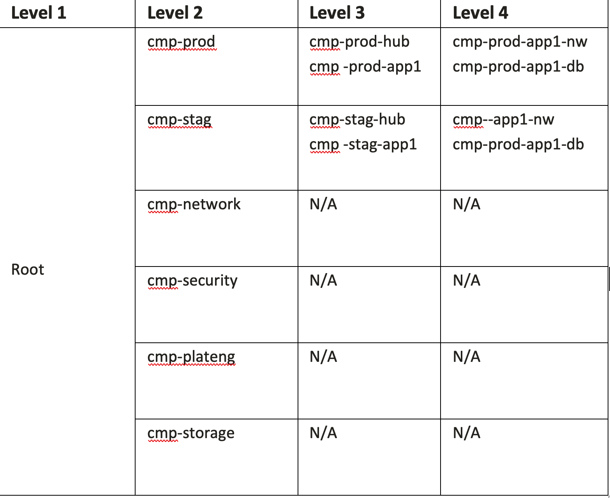

# Template for Nexi Application provisioning - complex input - manual template

In order to provision a new application make a copy of this folder and rename it.

After that edit the configuration files in order to specify the inputs for provisioning your new tenant.

## OCI Credentials

In order to provide the OCI credentials that terraform needs in order to connect to OCI perform the following:

-  Copy under the same folder ```terraform.tfvars.template``` and rename it to ```terraform.tfvars```
-  Edit the ```terraform.tfvars``` file and provide your credentials.

```
### TENANCY DETAILS

# Get this from the bottom of the OCI screen (after logging in, after Tenancy ID: heading)
tenancy_id="<tenancy OCID"
# Get this from OCI > Identity > Users (for your user account)
user_id="<user OCID>"

# the fingerprint can be gathered from your user account (OCI > Identity > Users > click your username > API Keys fingerprint (select it, copy it and paste it below))
fingerprint="<PEM key fingerprint>"
# this is the full path on your local system to the private key used for the API key pair
private_key_path="<path to the private key that matches the fingerprint above>"

# region (us-phoenix-1, ca-toronto-1, etc)
region="<your home region>"
```

## Tenant IAM Compartments Structure

In this template, just as an example, we'll be providing the structure described in the diagram bellow.

 

I want to emphasize that this is not limited to this specific structure. You can define your tenant template with any IAM Compartments topology.

In the example structure bellow we have the following IAM Compartments structure:

 - 2nd half of the production level 3:
     - ```cmp-prod-<application-name>``` which is a container for the rest of the application production compartments and it is also a spoke VCN connected to a shared production HUB VCN.
     - ```cmp-stag-<application-name>``` which is a container for the rest of the application staging compartments and it is also a spoke VCN connected to a shared staging HUB VCN.


Edit the ```iam.auto.tfvars```:

```
# Search and replace: 
#     - <parent_compartment_ocid> with your parent compartment OCID
#     - <application_name> with your application name
#     - <application_acronym> with your application acronym

# Compartments config Variable

app_compartments_config = {
  default_compartment_id = "<parent_compartment_ocid>"
  default_defined_tags   = {}
  default_freeform_tags  = null
  compartments = {

    # Production Compartments
    cmp-prod-<application_acronym> = {
      description    = "Compartment holding production resources of <application_name> application"
      compartment_id = "<parent_compartment_ocid>"
      defined_tags   = null
      freeform_tags  = null
      enable_delete  = true
      sub_compartments = {
        cmp-prod-<application_acronym>-nw = {
          description   = "Compartment holding production network resources of <application_name> application"
          defined_tags  = null
          freeform_tags = null
          enable_delete = true
          sub_compartments = {}
        }
        cmp-prod-<application_acronym>-db = {
          description   = "Compartment holding production database resources of <application_name> application"
          defined_tags  = null
          freeform_tags = null
          enable_delete = true
          sub_compartments = {}
        }
      }
    }

    #Staging Compartments
    cmp-stag-<application_acronym> = {
      description    = "Compartment holding staging resources of <application_name> application"
      compartment_id = "<parent_compartment_ocid>"
      defined_tags   = null
      freeform_tags  = null
      enable_delete  = true
      sub_compartments = {
        cmp-stag-<application_acronym>-nw = {
          description   = "Compartment holding staging network resources of <application_name> application"
          defined_tags  = null
          freeform_tags = null
          enable_delete = true
          sub_compartments = {}
        }
        cmp-stag-<application_acronym>-db = {
          description   = "Compartment holding staging database resources of <application_name> application"
          defined_tags  = null
          freeform_tags = null
          enable_delete = true
          sub_compartments = {}
        }
      }
    }
  }
}
```
Please note that the values keys are used as resources/object names in OCI.

Search and replace: 

- ```<parent_compartment_ocid>``` with your parent compartment OCID
- ```<application_name>``` with your application name
- ``` <application_acronym>``` with your application acronym


Feel free to replace any other configuration you want.

## Tenant Networking Topology

In this template, just as an example, we'll be providing the structure described in the diagram bellow.

 
 

I want to emphasize that this is not limited to this specific structure. You can define your tenant template with any networking topology.

Please note the following matching between the VCNs in the diagram and our predefined categories:
- production vcns:
    -  <application_acronym>prod01-vcn
- staging vcns:
    - <application_acronym>stag01-vcn

Edit the ```networking.auto.tfvars``` file:

```
# Search and replace: 
#     - <application_name> with your application name
#     - <application_acronym> with your application acronym

networking = {

  # PROD VCNs
  prod_networking = {
    default_network_compartment_name = "cmp-prod-<application_acronym>-nw"
    service_label                    = "<application_name>"
    service_gateway_cidr             = "all-services-in-oracle-services-network"
    drg_id                           = null
    vcns = {
      # Production VCN
      <application_acronym>prod01-vcn = {
        compartment_name  = "cmp-prod-<application_acronym>-nw"
        cidr              = "10.0.0.0/22"
        dns_label         = "<application_acronym>prod01"
        is_create_igw     = false
        is_attach_drg     = false
        block_nat_traffic = false
        defined_tags      = null
        freeform_tags     = null
        subnets = {
          prod_private_infra = {
            compartment_name = "cmp-prod-<application_acronym>-nw"
            defined_tags     = null
            freeform_tags    = null
            cidr             = "10.0.0.0/24"
            dns_label        = "prdprvinfr"
            dhcp_options_id  = null
            security_lists   = {}
            private          = true
          }
          prod_private_app = {
            compartment_name = "cmp-prod-<application_acronym>-nw"
            defined_tags     = null
            freeform_tags    = null
            cidr             = "10.0.1.0/24"
            dns_label        = "prdprvapp"
            dhcp_options_id  = null
            security_lists   = {}
            private          = true
          }
          prod_private_db = {
            compartment_name = "cmp-prod-<application_acronym>-nw"
            defined_tags     = null
            freeform_tags    = null
            cidr             = "10.0.2.0/24"
            dns_label        = "prdprvdb"
            dhcp_options_id  = null
            security_lists   = {}
            private          = true
          }
        }
      }
    }
  }

    # STAG VCNs
  stag_networking = {
    default_network_compartment_name = "cmp-stag-<application_acronym>-nw"
    service_label                    = "<application_name>"
    service_gateway_cidr             = "all-services-in-oracle-services-network"
    drg_id                           = null
    vcns = {
      # STAG VCN
      <application_acronym>stag01-vcn = {
        compartment_name  = "cmp-stag-<application_acronym>-nw"
        cidr              = "192.168.0.0/17"
        dns_label         = "<application_acronym>stag01"
        is_create_igw     = false
        is_attach_drg     = false
        block_nat_traffic = false
        defined_tags      = null
        freeform_tags     = null
        subnets = {
          stag_private_infra = {
            compartment_name = "cmp-stag-<application_acronym>-nw"
            defined_tags     = null
            freeform_tags    = null
            cidr             = "192.168.0.0/24"
            dns_label        = "stagprvinfr"
            dhcp_options_id  = null
            security_lists   = {}
            private          = true
          }
          stag_private_app = {
            compartment_name = "cmp-stag-<application_acronym>-nw"
            defined_tags     = null
            freeform_tags    = null
            cidr             = "192.168.1.0/24"
            dns_label        = "stagprvapp"
            dhcp_options_id  = null
            security_lists   = {}
            private          = true
          }
          stag_private_db = {
            compartment_name = "cmp-stag-<application_acronym>-nw"
            defined_tags     = null
            freeform_tags    = null
            cidr             = "192.168.2.0/24"
            dns_label        = "stagprvdb"
            dhcp_options_id  = null
            security_lists   = {}
            private          = true
          }
        }
      }
    }
  }
}
```
Please note that the values keys are used as resources/object names in OCI specifically for VCNs, subnets and security lists.

Search and replace: 
- ```<application_name>``` with your application name
- ```<application_acronym>``` with your application acronym

Feel free to replace any other configuration you want.

## Network Security Configuration

We're creating 2 categories of NSGs:
- production NSGs - in this category the user will be able to define a set of NSGs attached to production VCNs
- staging NSGs - in this category the user will be able to define a set of NSGs attached to production VCNs

I want to emphasize that this is not limited to this specific structure. You can define your tenant template with any networking security topology.

- ```app_network_sec_config```:
     - Under the network security you can define multiple NSGs for one of the vcns provisioned during app provisioning
     - You can have multiple elements under the ```app_network_sec_config```

Edit the ```network-security.auto.tfvars``` file:

```

# Search and replace: 
#     - <application_name> with your application name
#     - <application_acronym> with your application acronym


### app network security
app_network_sec_config = {
  # Prod Network Security
  <application_name>_netsec_<application_acronym>prod01-vcn = {
    default_compartment_name = "cmp-prod-<application_acronym>-nw",
    vcn_name                 = "<application_acronym>prod01-vcn",
    default_defined_tags     = null,
    default_freeform_tags    = null,
    security_lists           = {},
    nsgs = {
      nsg_db_<application_name>_netsec_<application_acronym>prod01-vcn = {
        compartment_name = "cmp-prod-<application_acronym>-nw"
        defined_tags     = null,
        freeform_tags    = null,
        ingress_rules = [
          {
            description = "APP NSGs"
            stateless   = false
            protocol    = "6"
            src         = "nsg_app_<application_name>_netsec_<application_acronym>prod01-vcn"
            src_type    = "NSG_NAME"
            src_port    = null
            dst_port = {
              min = "1521"
              max = "1521"
            }
            icmp_code = null
            icmp_type = null
          }
        ]
        egress_rules = [
          {
            description = "egress to anywhere"
            stateless   = false
            protocol    = "all"
            dst         = "0.0.0.0/0"
            dst_type    = "CIDR_BLOCK"
            src_port    = null
            dst_port    = null
            icmp_code   = null
            icmp_type   = null
          }
        ]
      },
      nsg_app_<application_name>_netsec_<application_acronym>prod01-vcn = {
        compartment_name = "cmp-prod-<application_acronym>-nw"
        defined_tags     = null,
        freeform_tags    = null,
        ingress_rules = [
          {
            description = "APP NSG"
            stateless   = false
            protocol    = "6"
            src         = "0.0.0.0/0"
            src_type    = "CIDR_BLOCK"
            src_port    = null
            dst_port = {
              min = "443"
              max = "443"
            }
            icmp_code = null
            icmp_type = null
          }
        ]
        egress_rules = [
          {
            description = "egress to anywhere"
            stateless   = false
            protocol    = "all"
            dst         = "0.0.0.0/0"
            dst_type    = "CIDR_BLOCK"
            src_port    = null
            dst_port    = null
            icmp_code   = null
            icmp_type   = null
          }
        ]
      }
    }
  }

  # Stag Network Security
  <application_name>_netsec_<application_acronym>stag01-vcn = {
    default_compartment_name = "cmp-prod-<application_acronym>-nw",
    vcn_name                 = "<application_acronym>stag01-vcn",
    default_defined_tags     = null,
    default_freeform_tags    = null,
    security_lists           = {},
    nsgs = {
      nsg_db_<application_name>_netsec_<application_acronym>stag01-vcn = {
        compartment_name = "cmp-stag-<application_acronym>-nw"
        defined_tags     = null,
        freeform_tags    = null,
        ingress_rules = [
          {
            description = "APP NSGs"
            stateless   = false
            protocol    = "6"
            src         = "nsg_app_<application_name>_netsec_<application_acronym>stag01-vcn"
            src_type    = "NSG_NAME"
            src_port    = null
            dst_port = {
              min = "1521"
              max = "1521"
            }
            icmp_code = null
            icmp_type = null
          }
        ]
        egress_rules = [
          {
            description = "egress to anywhere"
            stateless   = false
            protocol    = "all"
            dst         = "0.0.0.0/0"
            dst_type    = "CIDR_BLOCK"
            src_port    = null
            dst_port    = null
            icmp_code   = null
            icmp_type   = null
          }
        ]
      },
      nsg_app_<application_name>_netsec_<application_acronym>stag01-vcn = {
        compartment_name = "cmp-stag-<application_acronym>-nw"
        defined_tags     = null,
        freeform_tags    = null,
        ingress_rules = [
          {
            description = "APP NSG"
            stateless   = false
            protocol    = "6"
            src         = "0.0.0.0/0"
            src_type    = "CIDR_BLOCK"
            src_port    = null
            dst_port = {
              min = "443"
              max = "443"
            }
            icmp_code = null
            icmp_type = null
          }
        ]
        egress_rules = [
          {
            description = "egress to anywhere"
            stateless   = false
            protocol    = "all"
            dst         = "0.0.0.0/0"
            dst_type    = "CIDR_BLOCK"
            src_port    = null
            dst_port    = null
            icmp_code   = null
            icmp_type   = null
          }
        ]
      }
    }
  }
}
```

Search and replace: 
- <application_name> with your application name
- <application_acronym> with your application acronym

Feel free to replace any other configuration you want.

## Application Monitoring Configuration

We're creating 2 categories of OCI Monitoring events:

- ```cmp-prod-<application_acronym>``` - OCI Events to monitor "*produdction*" resources.
- ```cmp-stag-<application_acronym>``` - OCI Events to monitor only "*staging*" specific resources.

To define events you'll need to provide the following, as part of the ```event_rules``` variable:
 - ```default_compartment_name``` - the compartment to be used if when the ```event_rule``` is defined the ```compartment_name``` is missing.
 - A number of event rules where the ```event_rule``` key will be the ```event_rule``` name
    - ```compartment_name``` - name the of the compartment where the ```event_rule``` will be created
    - ```condition```- the condition that will trigger the event
    - ```description``` - event description
    - ```is_enabled``` - enable or disable the event 
    - ```actions``` : a list of actions to be performed when the event is triggered
        - ```action_type``` - the action type
        - ```is_enabled``` - enable or disable the action
        - ```description``` - action description
        - ```function_id``` - if a calling a function is the action then specify the function ocid
        - ```stream_id``` - if sending a message to a stream is the action then specify stream ocid
        - ```topic_id``` : if sending a message to a notification topic is the action then specify OCI Notification ocid


Edit the ```monitoring.auto.tfvars``` file:

```

# Search and replace: 
#     - <application_acronym> with your application acronym
#     - <ocid-stream-ocid> with your OCI Stream OCID 


event_rules = {
  default_compartment_name = "cmp-prod-<application_acronym>"
  event_rules = {
    # Production Resources Monitoring
    rule_prod_vcn_create = {
      actions = [{
        action_type = "OSS"
        description = "Write event data on Streaming Service"
        function_id = null
        is_enabled  = true
        stream_id   = "<ocid-stream-ocid>"
        topic_id    = null
      }]
      compartment_name = "cmp-prod-<application_acronym>"
      condition        = "{\"eventType\": \"com.oraclecloud.virtualnetwork.createvcn\"}"
      description      = "Test Event Rule - Prod VCN Create"
      is_enabled       = true
    }
    rule_prod_vcn_update = {
      actions = [{
        action_type = "OSS"
        description = "Write event data on Streaming Service"
        function_id = null
        is_enabled  = true
        stream_id   = "<ocid-stream-ocid>"
        topic_id    = null
      }]
      compartment_name = "cmp-prod-<application_acronym>"
      condition        = "{\"eventType\": \"com.oraclecloud.virtualnetwork.updatevcn\"}"
      description      = "Test Event Rule - Prod VCN Update"
      is_enabled       = true
    }

    # Staging Resources Monitoring
    rule_stag_vcn_create = {
      actions = [{
        action_type = "OSS"
        description = "Write event data on Streaming Service"
        function_id = null
        is_enabled  = true
        stream_id   = "<ocid-stream-ocid>"
        topic_id    = null
      }]
      compartment_name = "cmp-stag-<application_acronym>"
      condition        = "{\"eventType\": \"com.oraclecloud.virtualnetwork.createvcn\"}"
      description      = "Test Event Rule - Stag VCN Create"
      is_enabled       = true
    }
    rule_prod_vcn_update = {
      actions = [{
        action_type = "OSS"
        description = "Write event data on Streaming Service"
        function_id = null
        is_enabled  = true
        stream_id   = "<ocid-stream-ocid>"
        topic_id    = null
      }]
      compartment_name = "cmp-stag-<application_acronym>"
      condition        = "{\"eventType\": \"com.oraclecloud.virtualnetwork.updatevcn\"}"
      description      = "Test Event Rule - Stag VCN Update"
      is_enabled       = true
    }
  }
}

```

Search and replace: 
- ```<application_acronym>``` with your application acronym
- ```<ocid-stream-ocid>``` with your OCI Stream OCID

Feel free to replace any other configuration you want.

## State File

- Note that each and every tenant will have its own state file.
- In this example the state file is local but storing it remotelly in a shared location is fully suported.


## Notes/Issues

- Please note that this module contains a deprecated input value: ```projects``` which was used in the past to create sub-structures inside an application. 

## Versions

This module has been developed and tested by running terraform on macOS Monterey Version 12.2.1 

```
$ terraform --version
Terraform v1.1.3
on darwin_amd64
+ provider registry.terraform.io/hashicorp/oci v4.64.0
+ provider registry.terraform.io/hashicorp/time v0.7.2

Your version of Terraform is out of date! The latest version
is 1.1.7. You can update by downloading from https://www.terraform.io/downloads.html

```

## Run the automation

```
terraform init


Initializing modules...
- nexi-oci-app-provisioning.oci-iam-compartments in ../../../modules/oci-iam-compartments
Downloading git::https://github.com/oracle-terraform-modules/terraform-oci-tdf-iam-compartments.git?ref=v0.2.4 for nexi-oci-app-provisioning.oci-iam-compartments.oci_iam_compartments...
- nexi-oci-app-provisioning.oci-iam-compartments.oci_iam_compartments in .terraform/modules/nexi-oci-app-provisioning.oci-iam-compartments.oci_iam_compartments
- nexi-oci-app-provisioning.oci-monitoring in ../../../modules/oci-monitoring
Downloading git::ssh://git@cosmindev.github.com/fsana/oci_terraform_events.git for nexi-oci-app-provisioning.oci-monitoring.oci_events...
- nexi-oci-app-provisioning.oci-monitoring.oci_events in .terraform/modules/nexi-oci-app-provisioning.oci-monitoring.oci_events
- nexi-oci-app-provisioning.oci-network-security in ../../../modules/oci-network-security
Downloading git::https://github.com/oracle-terraform-modules/terraform-oci-tdf-network-security.git?ref=v0.9.7 for nexi-oci-app-provisioning.oci-network-security.oci_security_policies...
- nexi-oci-app-provisioning.oci-network-security.oci_security_policies in .terraform/modules/nexi-oci-app-provisioning.oci-network-security.oci_security_policies
- nexi-oci-app-provisioning.oci-prod-network in ../../../modules/oci-network
Downloading git::https://github.com/oracle-quickstart/oci-cis-landingzone-quickstart.git?ref=v2.3.1.0 for nexi-oci-app-provisioning.oci-prod-network.opco_vcns...
- nexi-oci-app-provisioning.oci-prod-network.opco_vcns in .terraform/modules/nexi-oci-app-provisioning.oci-prod-network.opco_vcns/modules/network/vcn-basic
- nexi-oci-app-provisioning.oci-stag-network in ../../../modules/oci-network
Downloading git::https://github.com/oracle-quickstart/oci-cis-landingzone-quickstart.git?ref=v2.3.1.0 for nexi-oci-app-provisioning.oci-stag-network.opco_vcns...
- nexi-oci-app-provisioning.oci-stag-network.opco_vcns in .terraform/modules/nexi-oci-app-provisioning.oci-stag-network.opco_vcns/modules/network/vcn-basic

Initializing the backend...

Initializing provider plugins...
- Finding hashicorp/oci versions matching "~> 4.64.0"...
- Finding latest version of hashicorp/time...
- Installing hashicorp/oci v4.64.0...
- Installed hashicorp/oci v4.64.0 (signed by HashiCorp)
- Installing hashicorp/time v0.7.2...
- Installed hashicorp/time v0.7.2 (signed by HashiCorp)

Terraform has created a lock file .terraform.lock.hcl to record the provider
selections it made above. Include this file in your version control repository
so that Terraform can guarantee to make the same selections by default when
you run "terraform init" in the future.

Terraform has been successfully initialized!
```


```
terraform plan

terraform apply
```

## Outputs

 - This module is returning both a hierarchical and a flat structure of the:
    - IAM Compartments
    - Network topology
    - Monitoring Configuration

that has been provisioned.

We're exposing both versions as flat is easy to consume by other automations where hierarchical is easy to read by end user.

## Terraform modules that are used by this project

* ```../../../nexi-oci-app-provisioning``` 

* https://github.com/oracle-terraform-modules/terraform-oci-tdf-iam-compartments/tree/v0.2.4

* https://github.com/oracle-quickstart/oci-cis-landingzone-quickstart/tree/stable-2.3.1.0/modules/network/vcn-basic

* https://github.com/oracle-terraform-modules/terraform-oci-tdf-network-security/tree/v0.9.7

* https://github.com/fsana/oci_terraform_events

## Contributing

This project is open source. Oracle appreciates any contributions that are made by the open source community.

## License

Copyright (c) 2022, Oracle and/or its affiliates.

Licensed under the Universal Permissive License v 1.0 as shown at https://oss.oracle.com/licenses/upl.

See [LICENSE](LICENSE) for more details.